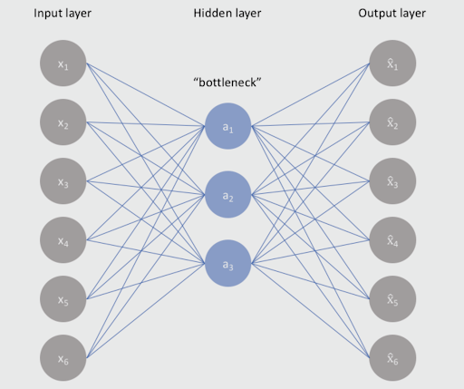
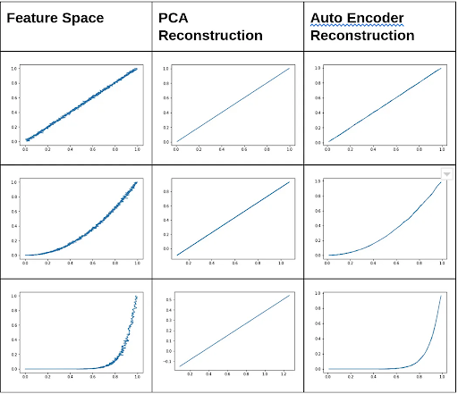

```{r setup, include=FALSE,echo=TRUE}
knitr::opts_chunk$set(message = F)
knitr::opts_chunk$set(warning = F)
knitr::opts_chunk$set(echo = FALSE, eval = TRUE,cache=TRUE,warning = FALSE,message = FALSE)
knitr::opts_chunk$set(fig.height = 3)
knitr::opts_chunk$set(fig.width = 4.5)
knitr::opts_chunk$set(fig.align="center")
```

```{r library, include=FALSE,echo=TRUE}
library(tidyverse)
library(tidyr)
library(lubridate)
library(kableExtra)
library(knitr)
library(reshape2)
library(data.table)
library(ggplot2)
library(ggthemes)
library(tensorflow)
library(keras)
library(plotly)
library(tfdatasets)
library(ggfortify)
```


## 1. Introduction

Dimension reduction is the process of reducing the feature size of the data while minimizing the total information lost in the process[^9]. Real-world data in machine learning, data science, and computer vision often have an enormous number of inputs and features that may be hard to visualize and interpret using traditional methods. Because of this, we often need to reduce the size of the dataset using dimension-reduction techniques. 

In machine learning, dimension reduction methods play an important role in reducing the complexity of the model-fitting process. In data science, dimension reduction techniques can be used to focus on what data scientists deem the most important features in the dataset. In computer vision dimension reduction is used to process and interpret high-dimensional image and video data. 

Two common dimension reduction techniques are Principal Component Analysis and Auto Encoders. Autoencoders are a form of neural network that has a bottleneck structure[^10]. They work by taking in a large unlabeled dataset and spitting out a smaller network of output. They do this by minimizing reconstruction error. The bottleneck structure of the model allows the autoencoder to take in a large chunk of information, keep the major features and throw out the non-informative features. 


## 2. What is Autoencoder?

An autoencoder is a dimensional reduction method that compresses large data by minimizing the reconstruction error through an artificial neural network. This network is composed of two main parts: The encoder and the decoder. The encoder takes in the input and transforms it into a lower-dimensional latent space. The decoder then takes this compressed representation and reconstructs the original data as closely as possible. The basic structure of the neural network can be visualized below:

```{r, fig.width=6, fig.height=4, fig.cap="Structure for autoencoder"}

```


The main goal of using an autoencoder is to learn a compressed representation of the data that captures its essential characteristics while minimizing the reconstruction error between the original input and its compressed representation. Autoencoders are commonly used for tasks such as dimensionality reduction, data compression, and feature extraction. They are typically trained using unsupervised learning techniques and can be modified with additional constraints or regularization terms to encourage the learning of more robust or interpretable representations.


## 3. Variations of autoencoder models


There are many variations of autoencoders as well: Sparse autoencoder (SAE), Denoising autoencoder (DAE), Contractive autoencoder (CAE), Variational Autoencoders (VAE). Each type of autoencoder has its own strengths and weaknesses depending on the specific task at hand.

### 3.1. Sparse Autoencoder

This first type of neural network architecture learns to reconstruct input data by encoding it into a lower-dimensional representation and then decoding it back to the original form[^11]. The goal of an autoencoder is to minimize the difference between the input data and its reconstruction, which is typically measured using an objective function consist of a loss function such as mean squared error (MSE) and other parts:

$$
\text{Obj} = L(x,\hat x) + \lambda \sum_i |a^{h}_{i}|
$$
The second term take L1 regularization to penalize the absolute value of the vector of activations a in layer h for sample i,  which measures the sparsity. The regularization term can also take KL divergence, but we do not discuss it here.

Unlike a standard autoencoder, an SAE also imposes a constraint on the encoding layer to produce sparse representations, which means that only a small subset of the neurons are activated at any given time. This is achieved by adding a sparsity penalty term to the loss function, which encourages the model to use only a small number of features to represent the input. The sparsity constraint in an SAE can help to reduce overfitting and improve generalization performance, as well as make the model more interpretable by identifying the most important features of the input data. SAEs have been used in a variety of applications, including image and speech recognition, anomaly detection, and natural language processing.

### 3.2. Denoising Autoencoder 

A denoising autoencoder is similar to a standard autoencoder but with an added noise reduction component. In a DAE, the input data is first corrupted by adding some random noise to it. The network is then trained to reconstruct the original, noise-free input data from the corrupted input. By learning to remove the noise or unwanted variation from the input data, the denoising autoencoder can be used for tasks such as image denoising, speech enhancement, and data cleaning.

One advantage of using denoising autoencoders is that they can be trained in an unsupervised manner, which means that they do not require labeled data for training. Additionally, DAEs can be used in combination with other deep learning models, such as convolutional neural networks (CNNs) and recurrent neural networks (RNNs), to improve their performance.

### 3.3. Contractive Autoencoder

A contractive autoencoder adds an additional regularization term to the loss function called the "contractive penalty," which encourages the network to produce stable and robust representations of the input data. The contractive penalty measures the sensitivity of the encoding layer to small variations in the input data. By constraining the network to produce stable and robust representations, the CAE can learn features that are invariant to small variations in the input data, which can improve generalization performance and make the network more resistant to overfitting.

Compared to DAEs, CAEs have a different regularization mechanism that encourages stable representations rather than removing “noise.” Compared to SAEs, the CAEs have a different regularization term that measures the sensitivity of the encoding layer to small variations in the input data. The objective loss function, with the regularization term is given by:

$$J_{CAE}(\theta) = \sum_{x \in D_n} (L(x,g(f(x))) + \lambda||J_f(x)||^2_F)$$
Where the jacobian term is the sum of squares of all partial derivatives of the extracted features with respect to input dimension.

### 3.4. Variational Autoencoders

Variational autoencoders use probabilistic generative models in addition to autoencoders[^12].  The main difference between VAEs and traditional autoencoders is that VAEs learn a probabilistic distribution over the input data's latent space, allowing them to generate new data samples that are similar to the training data but not identical. This makes VAEs useful for tasks such as image and video generation, as well as data compression and feature extraction. The training process for VAEs involves optimizing two loss functions: a reconstruction loss that measures the difference between the input and the reconstructed output, and a regularization term that encourages the latent space to follow a predefined distribution. 

## 4. Autoencoder versus PCA

Autoencoder and principal component analysis (PCA) as two common methods for dimension reduction. As such, there are many strengths and weaknesses associated with each method. For example, autoencoders can capture non-linear relationships while PCA is limited to linear relationships. autoencoders for dimension reduction, such as faster computation times, reduced storage requirements, the ability to capture complex relationships, and the sensitivity to hyperparameters. The nonlinearity of autoencoders vs PCA can be visualized with the following simulation:

```{r, fig.width=6, fig.height=4, fig.cap="Autoencoder versus PCA"}

```

We can see that when the feature space has some nonlinear behavior, the PCA does a poor job of reconstructing the noise, while the autoencoder reconstruction is much more accurate. 


Comparison includes:

- PCA features are totally linearly uncorrelated with each other since features are projections onto the orthogonal basis[^7].

- PCA is generally faster and computationally cheaper than autoencoders

- A single-layered autoencoder with a linear activation function is similar to PCA and can achieve similar results in terms of dimensionality reduction

- Autoencoders can be prone to overfitting due to their high number of parameters, but this can be mitigated through careful design and regularization techniques

In order for dimensionality reduction to be successful, the features of the dataset should have some underlying structure in a lower dimensional space. This means that there should be some relationship or correlation between the features. If this is the case, traditional methods like PCA can be effective in reducing the dimensionality of the data.

However, if the lower dimensional structure of the data has non-linearity or curvature, autoencoders can be a better choice. Autoencoders can capture this non-linearity and encode more information in fewer dimensions, making them a more efficient and effective dimensionality reduction technique in such scenarios. Therefore, the choice between using PCA or autoencoders for dimensionality reduction depends on the structure and complexity of the data being analyzed.


## 5. Applications of Autoencoders

Applications of autoencoders vary from image and speech recognition, and text analysis, to anomaly detection. Autoencoders are versatile neural networks that can be used for a variety of tasks, including dimensionality reduction, feature extraction, image denoising, compression and search, anomaly detection, and missing value imputation. Autoencoders can efficiently reduce the dimensionality of high-dimensional data, making it easier to work with and process. They can also learn efficient codings of the data structure, which can be used for supervised learning tasks. In addition, autoencoders can be used to denoise and compress images, by minimizing the reconstruction error from the original target output, or to search for similar images by comparing the compressed embeddings. Autoencoders can also be used for anomaly detection, to detect fraudulent transactions or other highly imbalanced supervised tasks. Finally, autoencoders can be used for missing value imputation, by reconstructing the input data based on the learned structure of the data[^8].


## 6. Implementation: Soccer Player Data

In this example, we use the FIFA 23 soccer player data from
[Kaggle](https://www.kaggle.com/datasets/cashncarry/fifa-23-complete-player-dataset)[^1]. FIFA 23 is the most popular soccer videogame. The data contains the following information about all the professional soccer players in FIFA 23:

- Player characteristics: Name, Age, Height, Weight, Club,  etc.
- Player skill measures such as Crossing, Finishing, Dribbling, LongPassing, etc.
- Player position and corresponding rating in the game.

For more details of this data, please refer to [SOFIFA](https://sofifa.com/) and [Kaggle](https://www.kaggle.com/datasets/cashncarry/fifa-23-complete-player-dataset). The data contains 90 variables, and 42 of them are skill measures. We use PCA and autoencoder to reduce the dimensional of the data and to visualize the data into three/two dimensions with color by player position. We divided the position into four categories:

- Forward (FWD): ST, LW, LF, CF, RF, RW
- Midfielder (MID): CAM, LM, CM, RM, CDM
- Defender (DEF): LWB, RWB, LB, CB, RB
- Goal Keeper (GK)

### PCA 

We start from PCA as it is less complex than the autoencoder. We first divide the dataset in train set (0.8) and test set (0.2). For PCA, we only use the train set and we use the train and test set together in next section for autoencoder. We provide the following figure to represent the train set by first two component from PCA and colored by player position.

```{r, fig.align='center'}
rm(list = ls())
load("data/soccer.RData")


ggplot(as.data.frame(pca.all$x), aes(x = PC1, y = PC2, col = df.use[ids_train,]$BP)) + 
  geom_point() + scale_color_discrete(name = "location") + ggtitle("PCA with GK")
```
We can clear see one position GK (blue color) is successfully separated from other potions. However, we see Midfielder and Forward position can not be separated well. We then remove GK and do PCA on the new dataset and we will compare PCA and autoencoder on the new dataset to discover which one can separate three positions well in two/three dimensions.

After removing GK and conduct PCA again, we provide the two/three dimension scatter graph from the first two/three components for the soccer player set.
```{r}

ggplot(as.data.frame(pca$x), aes(x = PC1, y = PC2, col = df.rmgk[ids_train,]$BP)) + 
  geom_point()+scale_color_discrete(name = "location") + ggtitle("PCA two dimensions")

```

```{r, fig.width=6,fig.height=4}

knitr::include_graphics("figure/3dpca.png")
#pca_plotly <- plot_ly(as.data.frame(pca$x), x = ~PC1, y = ~PC2, z = ~PC3, color = ~df.rmgk[ids_train,]$BP) %>% 
 # add_markers() %>% layout(title = "PCA three dimensions") %>% style(mergin = "auto")
#pca_plotly 
```

From the scatter plot, we see that DEF is separated from FWD, while there is a lot overlap between MID and FWD. We then plot the accumulated explained variance by each component in the following figure. The first two components can explain 52\% variation in the data and the first three components can explain 60.8\%. Although the amount of explained variation of the first two/three components is quite large, we still lose a lot information and cannot separate the MID and FWD position well. Noted midfielder and forwards may share certain skill sets, such as dribbling, shooting, passing and physicality, the loses information may be important for separating plaer positions by skill measurement variables.

```{r,eval=TRUE, fig.width=4, fig.height=3}


pca_var <- pca$sdev^2
per_var <- cumsum(pca_var)/sum(pca_var) 

ggplot(as.data.frame(per_var), aes(y = as.numeric(per_var), x = 1:length(per_var)))+
 geom_point(colour = "blue") +  ylab("Explained variance") + xlab("Component") + 
  ggtitle("Explained Variance in PCA")
```

### Autoencoder

Then we perform the autoencoder analysis for this dataset. The autoencoder is constructed using the package 
Keras[^2] in R. We only consider three layers here: first layer is encoder with 12 nodes, the second layer is bottleneck with 3 nodes and the last layer is decoder with 12 nodes. Here, bottleneck layer has a lower dimensional than the input and output layer, thus can compress the input data and represent them in a lower dimension space. 

```{r, eval=FALSE, echo=TRUE}

model <- keras_model_sequential() %>%
  layer_dense(units = 12, activation = "relu", input_shape = ncol(x_train)) %>%
  layer_dense(units = 3, activation = "relu", name = "bottleneck") %>%
  layer_dense(units = 12, activation = "relu") %>%
  layer_dense(units = ncol(x_train))

model %>% compile(
  loss = "mean_squared_error", 
  optimizer = "adam"
)

history <- model %>% fit(
  x = x_train,
  y = x_train,
  epochs = 100,
  batch_size = 32,
  validation_data = list(x_test,x_test)
)
plot(history)
```

```{r, fig.width= 6, fig.cap="Autoencoder fitting history for train and test data"}
plot(history,  main = "Autoencoder fitting results")
```

The following code extract the results from bottleneck, in which represent the data in three dimensions.

```{r, echo=TRUE, eval=FALSE}
# extract results from bottleneck layer
intermediate_layer_model <- keras_model(inputs = model$input, outputs =  get_layer(model, "bottleneck")$output)
intermediate_output <- predict(intermediate_layer_model, x_train)
# col dimension of intermediate_output is 3, same as the nodes in this layer.
# create dataframe for plot figures.
aedf <- data.frame(node1 = intermediate_output[,1],
                   node2 = intermediate_output[,2],
                   node3 = intermediate_output[,3])
```

We also visualize the scatter graph in two dimension by the first two nodes, and in three dimension by all the three nodes.
```{r, echo=TRUE, eval=TRUE}
# two dimension
ggplot(aedf, aes(x = node1, y = node2,col =df.rmgk[ids_train,]$BP)) + 
  geom_point() + 
  scale_color_discrete(name = "location") + ggtitle("Autoencoder two dimension")
```

```{r, eval=FALSE}
ae_plotly <- plot_ly(aedf, x = ~node1, y = ~node2, z = ~node3, color=df.rmgk[ids_train,]$BP) %>% 
  add_markers() %>% layout(title = "Autoencoder three dimensions")
ae_plotly

```

```{r, fig.width=6 ,fig.height=4}
knitr::include_graphics("figure/3dae.png")
```
From both the two and three dimension graphs, we observe notable improvement in differentiating between MID and FWD. The autoencoder's ability to capture more complex relationships among the skill measure variables helped create a clearer separation between these positions. This suggests that the autoencoder was able to extract more distinctive features that distinguish midfielders and forwards.


## 7. Implementation: Face Images

In this application section, we explore a diverse dataaset of facial images sourced from Olivetti Faces[^3] [^6]. The images dataset consist 400 images (64 $\times$ 64) for 40 persons and each person with 10 photos from different angles. Our objective is to extract the intrinsic essence of these images while enhancing the efficacy of dimension reduction analysis. We conduct PCA on the image data for better comparison with autoencoder

```{r, eval=TRUE}
rm(list = ls())
```

We provide the first images for each person in the following graphs.
```{r, eval=TRUE,fig.width= 8, fig.height=4, fig.cap="Original first portaits for all persons"}
rm(list = ls())
load("data/image.RData")

# plot of 40 persons, first photograph for each person
par(mfrow = c(6,7), mar = rep(0,4))
for(i in 1:40){
  faces <- matrix(as.numeric(df[(10 * i -9),-4097]), nrow = 64)
  plot(as.raster(faces))
}# 64*64 = 4096, 4097 is for preson id.
```

The below code split images data into test-train sets by removing two images for each person. Therefore, the train set consist 320 images of all 40 persons but 8 images per person. The test set consist the other 80 images, 2 images per person. The matrix format df_train/df_test are for PCA, we also change the train and test set to suitable array format for autoencoder in df_train_array/df_test_array.

```{r,eval=FALSE,echo=TRUE}
set.seed(123)
train_ind <- (1:400 %% 10 <= 8) & (1:400 %% 10 > 0)
df <- df[,-4097]/255
df_train <- df[train_ind, -4097]
df_test <- df[!train_ind, -4097]

# same train and test set but change suitable format for autoencoder 
df_train_array <- as.matrix(df_train) %>% array_reshape(dim = c(nrow(df_train), 64,64,1))
df_test_array <- as.matrix(df_test) %>% array_reshape(dim = c(nrow(df_test), 64,64,1))

```

### PCA

We perform PCA on the train set. The root mean square error (RMSE) of PCA is 5.654. We provide the accumulated explained variance in PCA in the following graph.

```{r, eval=FALSE, echo=FALSE}
rmse_pca <- 0
for(i in 1:nrow(df_train)){
  rmse_pca <- rmse_pca + sum((df_train[i,] - df_train_reconstru_rescaled[i,])^2)
}
rmse_pca <- sqrt(rmse_pca/nrow(df_train))
```


```{r, eval=FALSE, echo=FALSE}
pca <- prcomp(df_train,center = TRUE, scale. = TRUE)
pca_var <- pca$sdev^2
per_var = cumsum(pca_var)/sum(pca_var)

```

```{r, eval=TRUE, echo=FALSE,fig.width=4, fig.height=3}
rm(list = ls())
load("data/image.RData")
ggplot(as.data.frame(per_var), aes(y = as.numeric(per_var), x = 1:length(per_var)))+
 geom_point(colour = "blue") + ylab("Explained variance") + xlab("Component") +
  theme_minimal()  + ggtitle("Explained Variance in PCA")
```

We see that first 25 components can explain 80\% variation. So we use first 25 components to do dimension reduction task and to reconstruct the images. We random select five persons (id = 3, 14, 15, 31, 38) and show the one original and one reconstructed portrait per person.

```{r, eval=FALSE, echo = TRUE}
pca_components <- pca$rotation[,1:25]
df_train_transformed <- as.matrix(df_train) %*% pca_components
df_train_reconstru <- df_train_transformed %*% t(pca_components)
df_train_reconstru_rescaled <- pmax(pmin(df_train_reconstru, 1), 0)
show_id <- sort(sample(1:40, 5, replace = FALSE))
```

The upper panel is for the original images and the lower panel is for reconstructed images from PCA. Although the first 25 components can account for 80\% variation, reconstructing images based on these components struggles to effectively capture the intricate facial features that define individual identities. The resulting reconstructed images often lack the fine-grained details, nuanced expressions, and subtle variations that make each face unique. While PCA succeeds in compressing the dimensionality of the data, its limitations become apparent in the realm of facial image analysis, where capturing the essence of faces requires a more sophisticated approach. 

```{r, eval=TRUE, echo=TRUE, fig.width= 6, fig.height=4, fig.cap="Original versus reconstructed figures by PCA"}
par(mfrow = c(2,5), mar = rep(0,4))
for(i in show_id){
  faces <- matrix(as.numeric(df_train[(8*i -7),]), nrow = 64)
  plot(as.raster(faces))
}

for(i in show_id){
  faces <- matrix(as.numeric(df_train_reconstru_rescaled[(8*i -7),]), nrow = 64)
  plot(as.raster(faces))
}
```


### Autoencoder

Then we apply autoencoder on the same train and test data. Here, we use the convolutional neural network (CNN) for image dimension reduction[^5]. The CNN for autoencoder is designed to encode input images into a lower-dimensional representation and then decode it back to its original form. Unlike traditional autoencoders, which use fully connected layers for encoding and decoding, a CNN autoencoder uses convolutional layers for its encoding and decoding steps. This allows the network to capture the spatial structure and local patterns present in the input image, making it well-suited for tasks such as image denoising, compression, and feature extraction[^4].

**Encoder**

We use the following code for encoder:

```{r, eval=FALSE, echo=TRUE}
input_layer <- 
  layer_input(shape = c(64,64,1))
encoder <- input_layer %>% 
  layer_conv_2d(filters = 8,
                kernel_size = c(3,3),
                activation = "relu",
                padding = "same") %>%
  layer_max_pooling_2d(pool_size =  c(2,2)) %>%
  layer_conv_2d(filters = 4,
                kernel_size = c(3,3),
                activation = "relu",
                padding = "same") %>%
  layer_max_pooling_2d(pool_size = c(2,2),
                       padding = "same")
```

The input layer is defined as a 64x64 grayscale image with a single channel. The encoder consists of two convolutional layers with 8 and 4 filters respectively, both using a 3x3 kernel and ReLU activation function. The "same" padding is used to ensure that the output size of the convolutional layers matches the input size. Max pooling layers are then applied with a 2x2 pool size to reduce the spatial dimensions of the feature maps. The second pooling layer uses "same" padding to avoid reducing the feature map size further. This encoder will convert the input image into a lower-dimensional representation that can be used as input for the decoder of the autoencoder.

**Decoder**

The decoder part is in the following code:

```{r, eval=FALSE,echo=TRUE}
decoder <- encoder %>% 
         layer_conv_2d(filters = 4, 
                       kernel_size = c(3,3), 
                       activation = 'relu',
                       padding = 'same') %>%   
         layer_upsampling_2d(c(2,2)) %>% 
         layer_conv_2d(filters = 8, 
                       kernel_size = c(3,3), 
                       activation = 'relu',
                       padding = 'same') %>%  
         layer_upsampling_2d(c(2,2)) %>% 
         layer_conv_2d(filters = 1, 
                       kernel_size = c(3,3), 
                       activation = 'sigmoid',
                       padding = 'same')
```

The decoder takes output from the encoder to reconstruct the original input image. Similarly to encoder, the decoder consists of three layers with ReLU activation function. The unsampling function is used to increase the spatial dimensions of the feature maps by a factor of 2. The last convolutional layer with a single filter uses a sigmoid activation function to output the reconstructed image. The "same" padding is used in each layer to match the input and output dimensions.

**Model compile**

With the encoder and decoder part, the autoencoder model is defined as:

```{r, eval=FALSE,echo=TRUE}
model <- keras_model(inputs = input_layer, outputs = decoder)
```

We provide the summary of the model to show the structure and the number of parameters in details in the following:

```{r, eval=TRUE,echo=FALSE}
input_layer <- 
  layer_input(shape = c(64,64,1))
encoder <- input_layer %>% 
  layer_conv_2d(filters = 8,
                kernel_size = c(3,3),
                activation = "relu",
                padding = "same") %>%
  layer_max_pooling_2d(pool_size =  c(2,2)) %>%
  layer_conv_2d(filters = 4,
                kernel_size = c(3,3),
                activation = "relu",
                padding = "same") %>%
  layer_max_pooling_2d(pool_size = c(2,2),
                       padding = "same")
decoder <- encoder %>% 
         layer_conv_2d(filters = 4, 
                       kernel_size = c(3,3), 
                       activation = 'relu',
                       padding = 'same') %>%   
         layer_upsampling_2d(c(2,2)) %>% 
         layer_conv_2d(filters = 8, 
                       kernel_size = c(3,3), 
                       activation = 'relu',
                       padding = 'same') %>%  
         layer_upsampling_2d(c(2,2)) %>% 
         layer_conv_2d(filters = 1, 
                       kernel_size = c(3,3), 
                       activation = 'sigmoid',
                       padding = 'same')
model <- keras_model(inputs = input_layer, outputs = decoder)
summary(model)
```
The model consist of five convolutional layers, two maximum pooling layers, and two unsampling layers, and we have 889 parameters in this model.

The model is then compiled using the mean squared error loss function and the Adam optimizer. We use the test set as the validation data in fitting the model. The epoch is 100 and batch size is 8. The shuffle parameter specifies whether to shuffle the training data at the beginning of each epoch. When "shuffle" is set to "TRUE", the training data is randomly shuffled before each epoch. This is helpful to reduce the risk of overfitting to the training data and improve the generalization performance of the model.

```{r, echo=TRUE,eval=FALSE}
model %>% compile(
  loss = "mean_squared_error", 
  optimizer = "adam"
)

history <- model %>% fit(
  x = df_train_array,
  y = df_train_array,
  shuffle = TRUE,
  epochs = 100,
  batch_size = 8,
  validation_data = list(df_test_array,df_test_array)
)
```

The plot of fitting history is provided as follows:
```{r, echo=TRUE,eval=TRUE, fig.width=6, fig.cap="Autoencoder fitting history"}
plot(history)
```

We then reconstruct the portraits by autoencoder.
```{r, echo=TRUE,eval=FALSE}
rc_ae <- predict(model, df_train_array) # reconstructed on train data.
```
The RMSE of autoencoder on train set is 2.616, which is only 46\% of the RMSE of PCA (5.654). 

The following graphs display the original (upper panel), reconstructed by PCA (middle panel) and reconstructed by autoencoder (lower panel) portraits of sampled five persons. We witness remarkable improvements in the reconstructed facial images from autoencoder. The reconstructed figures from autoencoders exhibit a striking resemblance to the original images, accurately reproducing the fine-grained textures, expressions, and unique characteristics of the faces that define each individual. 

```{r, eval=TRUE, echo=TRUE, fig.width= 6, fig.height=4, fig.cap="Original versus reconstructed figures by PCA and autoencoder in train set"}
par(mfrow = c(3,5), mar = rep(0,4))
for(i in show_id){
  faces <- matrix(as.numeric(df_train[(8*i -7),]), nrow = 64)
  plot(as.raster(faces))
}

for(i in show_id){
  faces <- matrix(as.numeric(df_train_reconstru_rescaled[(8*i -7),]), nrow = 64)
  plot(as.raster(faces))
}

for(i in show_id){
  faces <- t(matrix(rc_ae[8*i -7,,,], nrow= 64))
  plot(as.raster(faces))
}
```


```{r, echo=FALSE, eval=FALSE}
rmse_ae <- 0
for(i in 1:dim(df_train_array)[1]){
  diff_mt <- df_train_array[i,,,] - rc_ae[i,,,]
  rmse_ae <- rmse_ae + sum(diff_mt^2)
}
rmse_ae <- sqrt(rmse_ae/nrow(df_train))
```

We also apply the autoencoder to the test set.
```{r, eval=FALSE, echo=TRUE}
df_test_transformed <- as.matrix(df_test) %*% pca_components
df_test_reconstru <- df_test_transformed %*% t(pca_components)
df_test_reconstru_rescaled <- pmax(pmin(df_test_reconstru, 1), 0) # restrain to (0,1)
```
The next graph display the original, reconstructed by PCA, and reconstructed by autoencoder images in test set.

```{r, eval=TRUE, echo=TRUE, fig.width= 6, fig.height=4, fig.cap="Original versus reconstructed figures by PCA and autoencoder in test set" }
par(mfrow = c(3,5), mar = rep(0,4))
for(i in show_id){
  faces <- matrix(as.numeric(df_test[(2*i),]), nrow = 64)
  plot(as.raster(faces))
}
for(i in show_id){
  faces <- matrix(as.numeric(df_test_reconstru_rescaled[(2*i),]), nrow = 64)
  plot(as.raster(faces))
}
for(i in show_id){
  faces <- t(matrix(rc_ae.test[2*i,,,], nrow= 64))
  plot(as.raster(faces))
}

```

We observe autoencoder continue to yield impressive results compared to PCA, This indicates that autoencoder excels in dimension reduction while maintaining superior performance in both train and test set. 

This application  highlights the autoencoder's superior ability to compress high-dimensional facial data while retaining crucial information, making it an ideal choice for advanced facial image analysis applications.

## 8. Conclusion

Dimension reduction is an important process in machine learning, data science, and computer vision. It involves reducing the number of features in a dataset while minimizing information loss. Autoencoders are a popular form of neural network used for dimension reduction, data compression, and feature extraction. They are trained using unsupervised learning techniques and work by minimizing the reconstruction error between the input data and its compressed representation. There are several variations of autoencoders, including sparse autoencoders, denoising autoencoders, contractive autoencoders, and variational autoencoders. Each type of autoencoder has its own strengths and weaknesses depending on the specific task at hand.  Applications such as in bioinformatics, autoencoders can be used to identify patterns in gene expression data, and can help identify biomarkers for disease diagnosis and treatment. Overall, **autoencoders are a powerful tool for reducing the complexity of high-dimensional data and extracting the most important features for analysis**.

It is important to explore implementing autoencoder models for their specific data and problem domains. With the availability of powerful machine learning libraries and frameworks, it is now easier than ever to build and train autoencoder models, even for those with limited programming experience. By experimenting with different architectures and hyperparameters, users can discover the potential of autoencoder dimension reduction for their own research or business needs.


## Github

Please find our [github repository](https://github.com/zhejiadong/PHP2650FinalProject) and the [github page](https://zhejiadong.github.io/PHP2650FinalProject/) for this post.


## Reference

[^1]: FIFA23 complete data. <https://www.kaggle.com/datasets/cashncarry/fifa-23-complete-player-dataset>
[^2]: Allaire, J. J., & Chollet, F. (2020). keras: R Interface to ‘Keras’. R package version 2.3. 0.0. Computer software]. <https://CRAN.R-project.org/package=keras>
[^3]: Data for MATLAB hackers. <https://cs.nyu.edu/~roweis/data.html>
[^4]: Ramamurthy, M., Robinson, Y. H., Vimal, S., & Suresh, A. (2020). Auto encoder based dimensionality reduction and classification using convolutional neural networks for hyperspectral images. Microprocessors and Microsystems, 79, 103280.
[^5]: Dimension reduction autoencoders. <https://subscription.packtpub.com/book/data/9781789538779/9/ch09lvl1sec39/dimension-reduction-autoencoders> 
[^6]: Olivetti database at ATT. <https://cam-orl.co.uk/facedatabase.html>
[^7]: Autoencoders vs PCA: when to use? <https://towardsdatascience.com/autoencoders-vs-pca-when-to-use-which-73de063f5d7>
[^8]: 7 Applications of Auto-Encoders every Data Scientist should know.
<https://towardsdatascience.com/6-applications-of-auto-encoders-every-data-scientist-should-know-dc703cbc892b>
[^9]: Carreira-Perpinán, M. A. (1997). A review of dimension reduction techniques. Department of Computer Science. University of Sheffield. Tech. Rep. CS-96-09, 9, 1-69.
[^10]: Bank, D., Koenigstein, N., & Giryes, R. (2020). Autoencoders. arXiv preprint arXiv:2003.05991.
[^11]: Ng, A. (2011). Sparse autoencoder. CS294A Lecture notes, 72(2011), 1-19.
[^12]: Kingma, D. P., & Welling, M. (2019). An introduction to variational autoencoders. Foundations and Trends® in Machine Learning, 12(4), 307-392.
