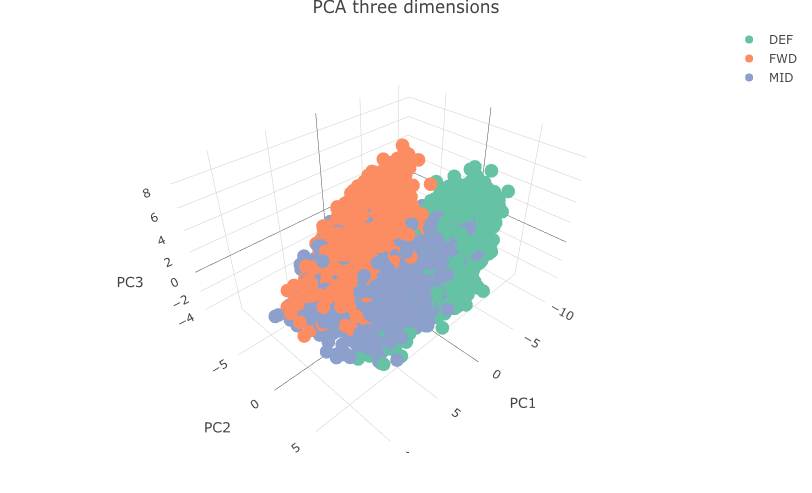
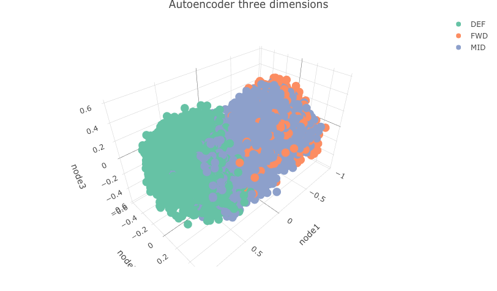

```{r setup, include=FALSE,echo=TRUE}
knitr::opts_chunk$set(message = F)
knitr::opts_chunk$set(warning = F)
knitr::opts_chunk$set(echo = FALSE, eval = TRUE,cache=TRUE,warning = FALSE,message = FALSE)
knitr::opts_chunk$set(fig.height = 3)
knitr::opts_chunk$set(fig.width = 4.5)
knitr::opts_chunk$set(fig.align="center")
```

```{r library, include=FALSE,echo=TRUE}
library(tidyverse)
library(tidyr)
library(lubridate)
library(kableExtra)
library(knitr)
library(reshape2)
library(data.table)
library(ggplot2)
library(ggthemes)
library(tensorflow)
library(keras)
library(plotly)
library(tfdatasets)
library(ggfortify)
```


## Introduction

## What is Autoencoder?

## Variations of autoencoder models

## Autoencoder versus PCA

## Applications of Autoencoders

## Implementation:Soccer Player Data

In this example, we use the FIFA 23 soccer player data from
[Kaggle](https://www.kaggle.com/datasets/cashncarry/fifa-23-complete-player-dataset)[^1]. FIFA 23 is the most popular soccer videogame. The data contains the following information about all the professional soccer players in FIFA 23:

- Player characteristics: Name, Age, Height, Weight, Club,  etc.
- Player skill measures such as Crossing, Finishing, Dribbling, LongPassing, etc.
- Player position and corresponding rating in the game.

For more details of this data, please refer to [SOFIFA](https://sofifa.com/) and [Kaggle](https://www.kaggle.com/datasets/cashncarry/fifa-23-complete-player-dataset). The data contains 90 variables, and 42 of them are skill measures. We use PCA and autoencoder to reduce the dimensional of the data and to visualize the data into three/two dimensions with color by player position. We divided the position into four categories:

- Forward (FWD): ST, LW, LF, CF, RF, RW
- Midfielder (MID): CAM, LM, CM, RM, CDM
- Defender (DEF): LWB, RWB, LB, CB, RB
- Goal Keeper (GK)

### PCA 

We start from PCA as it is less complex than the autoencoder. We first divide the dataset in train set(0.8) and test set(0.2). For PCA, we only use the train set and we use the train and test set together in next section for autoencoder. We provide the following figure to represent the train set by first two component from PCA and colored by player position.

```{r, fig.align='center'}
load("data/soccer.RData")


ggplot(as.data.frame(pca.all$x), aes(x = PC1, y = PC2, col = df.use[ids_train,]$BP)) + 
  geom_point() + scale_color_discrete(name = "location") + ggtitle("PCA with GK")
```
We can clear see one position GK (blue color) is successfully separated from other potions. However, we see Midfielder and Forward position can not be separated well. We then remove GK and do PCA on the new dataset and we will compare PCA and autoencoder on the new dataset to discover which one can separate three positions good in two/three dimensions.

```{r}

ggplot(as.data.frame(pca$x), aes(x = PC1, y = PC2, col = df.rmgk[ids_train,]$BP)) + 
  geom_point()+scale_color_discrete(name = "location") + ggtitle("PCA two dimensions")

```

```{r, fig.width=6,fig.height=4}


#pca_plotly <- plot_ly(as.data.frame(pca$x), x = ~PC1, y = ~PC2, z = ~PC3, color = ~df.rmgk[ids_train,]$BP) %>% 
 # add_markers() %>% layout(title = "PCA three dimensions") %>% style(mergin = "auto")
#pca_plotly 
```

We then plot the accumulated explained variance by each component in the following figure. The first two components can explain 52\% variation in the data and the first three components can explain 60.8\%. Althrough the amount of explained variation of the first two/three components is quite large, we still lose a lot information and cannot seperate the Midfielder and Forward position well.

```{r, fig.width=4, fig.height=3}

pca_var <- pca$sdev^2
per_var <- cumsum(pca_var)/sum(pca_var) 

ggplot(as.data.frame(per_var), aes(y = as.numeric(per_var), x = 1:length(per_var)))+
 geom_point(colour = "blue") + geom_line()+ ylab("Explained variance") + xlab("Component") +
  theme_minimal()  + ggtitle("Explained Variance in PCA")
```

### Autoencoder

Then we perform the autoencoder analysis for this dataset. The autoencoder is constructed using the package 
Keras[^2] in R. We only consider three layers here: first layer is encoder with 12 nodes, the second layer is bottleneck with 3 nodes and the last layer is decoder with 12 nodes. Here, bottleneck layer has a lower dimensional than the input and output layer, thus can compress the input data and represent them in a lower dimension space. 

```{r, eval=FALSE, echo=TRUE}

model <- keras_model_sequential() %>%
  layer_dense(units = 12, activation = "relu", input_shape = ncol(x_train)) %>%
  layer_dense(units = 3, activation = "relu", name = "bottleneck") %>%
  layer_dense(units = 12, activation = "relu") %>%
  layer_dense(units = ncol(x_train))

model %>% compile(
  loss = "mean_squared_error", 
  optimizer = "adam"
)

history <- model %>% fit(
  x = x_train,
  y = x_train,
  epochs = 100,
  batch_size = 32,
  validation_data = list(x_test,x_test)
)
plot(history)
```

```{r, fig.width= 6, fig.cap="Autoencoder fitting results for train and test data"}
plot(history,  main = "Autoencoder fitting results")
```


```{r, echo=TRUE, eval=FALSE}
# extract results from bottleneck layer
intermediate_layer_model <- keras_model(inputs = model$input, outputs =  get_layer(model, "bottleneck")$output)
intermediate_output <- predict(intermediate_layer_model, x_train)
# col dimension of intermediate_output is 3, same as the nodes in this layer.
# create dataframe for plot figures.
aedf <- data.frame(node1 = intermediate_output[,1],
                   node2 = intermediate_output[,2],
                   node3 = intermediate_output[,3])
```

Two dimension with the first two nodes

```{r, echo=TRUE, eval=TRUE}
# two dimension
ggplot(aedf, aes(x = node1, y = node2,col =df.rmgk[ids_train,]$BP)) + 
  geom_point() + 
  scale_color_discrete(name = "location") + ggtitle("Autoencoder two dimension")
```

 
Three dimension with the three nodes.

```{r, eval=FALSE}
ae_plotly <- plot_ly(aedf, x = ~node1, y = ~node2, z = ~node3, color=df.rmgk[ids_train,]$BP) %>% 
  add_markers() %>% layout(title = "Autoencoder three dimensions")
ae_plotly

```

```{r, fig.width=6 ,fig.height=4}

```


## Implementation: Face images


## Conclusion


## Reference

[^1]: <https://www.kaggle.com/datasets/cashncarry/fifa-23-complete-player-dataset>
[^2]: Allaire, J. J., & Chollet, F. (2020). keras: R Interface to ‘Keras’. R package version 2.3. 0.0. Computer software]. <https://CRAN.R-project.org/package=keras>
